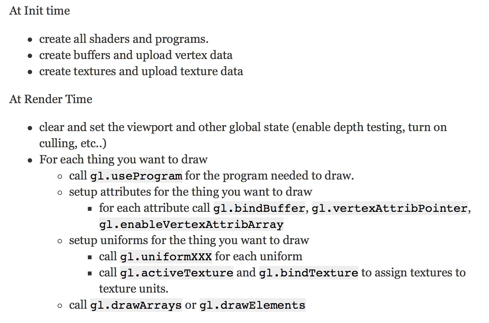

texture3D.html => lessCode.html => multiple_object.html => large_object.html
```
transform
texture
gl.drawArrays
gl.drawElements
图元
```
### Why is the attribute vec4 but gl.vertexAttribPointer size 3
-WebGL provides defaults for those you don't supply. The defaults are 0, 0, 0, 1 where x = 0, y = 0, z = 0 and w = 1
- 变换顺序: 模型变换 * 视图变换(相机) * 投影变换(透视)
### 绘制过程
```
从着色器开始,(varying传递 颜色/纹理等)
1. gl.useProgram(program);
2. get Location (属性位置)
3. createBuffer bindBuffer bufferData (属性绑定缓冲, 位置/纹理等)
4. 恒量赋值
5. createTexture bindTexture texImage2D (纹理处理)
6. draw (绘制) =>
7. 变换处理 =>
8. projectionMatrix <= makePerspective(G.degToRad(60), aspect, 1, 2000); (投影变换到裁剪坐标/得到视锥体)
9. cameraMatrix <= makeLookAt(cameraPosition, target, up); (相机位置)
10. viewMatrix <= makeInverse(cameraMatrix); (视图变换)
11. 模型变换
12. 矩阵相乘 => 模型变换 * 视图变换(相机) * 投影变换(透视)
13. requestAnimationFrame() => 针对模型变换/相机位置等
14. 光照...
```


```
If we had different shader programs you'd need to call gl.useProgram before um... using each program.
```
```
If the program we're about to draw with is the same as the previous program we drew with then
there's no need to call gl.useProgram.
Similarly if we're drawing with the same shape/geometry/vertices we previously drew with
there's no need to set those up again.
```
### bufferInfo
```
position
texture
color
normal
```

### matrix
```
projectionMatrix
cameraMatrix
viewMatrix
modelMatrix => normalMatrix
modelMatrix => matrix ( normalMatrix * viewMatrix * projectionMatrix )
```
### light
```
用点积求光强
```